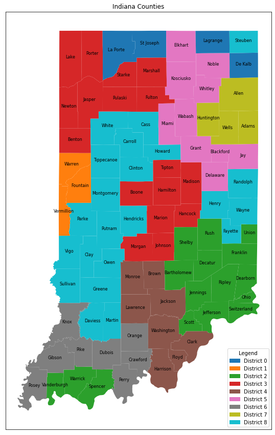

# Indiana County Allocation

This code is designed to allocate the population of Indiana's counties into nine districts, with the objective of minimizing the total inter-county distance within each district. The allocation is done using linear programming techniques.

## Prerequisites

Before running the code, make sure you have the following libraries installed:

- pandas
- numpy
- pulp

You can install these libraries using pip:

pip install pandas numpy pulp

## Data

The code requires the following input data files:

- `distances.csv`: A CSV file containing the distances between counties.
- `adjacent_counties.csv`: A CSV file containing the information about adjacent counties.
- `indiana_popdata.csv`: A CSV file containing population demographics of Indiana counties.
- `indiana_data.csv`: A CSV file containing additional data about Indiana counties.

Make sure these files are present in the same directory as the code file.

## Running the Code

The code will create a linear programming model and allocate the population of Indiana counties into nine districts. The objective is to minimize the total inter-county distance within each district. The allocation results will be displayed as output.

## Constraints

The code includes several constraints to ensure a valid and optimized allocation:

- Each county must be allocated to one and only one district.
- Each district should contain approximately an equal number of people.
- Counties in the same district should be contiguous.
- Additional improvement assignments are made to account for pairs of counties that are geographically far apart with population centers in between them.

## Results

The code will output the allocation results, showing which counties are assigned to each district and the total inter-county distance within each district.

Example output:

